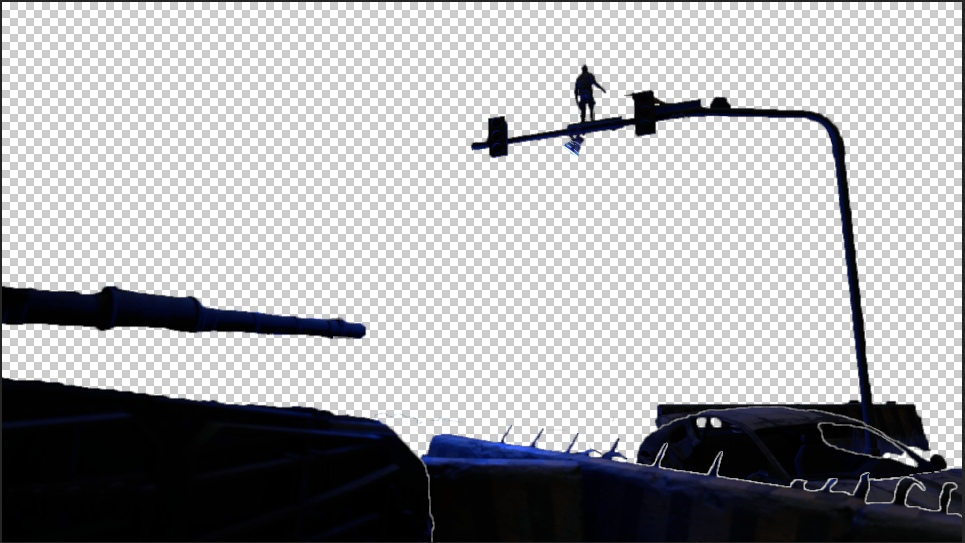
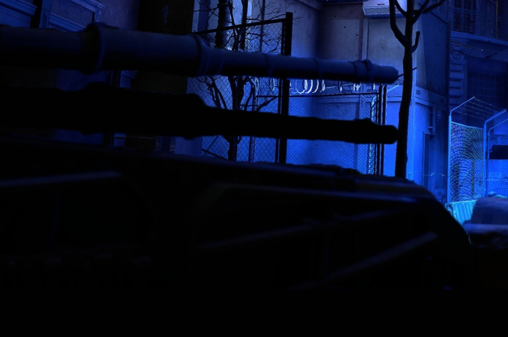
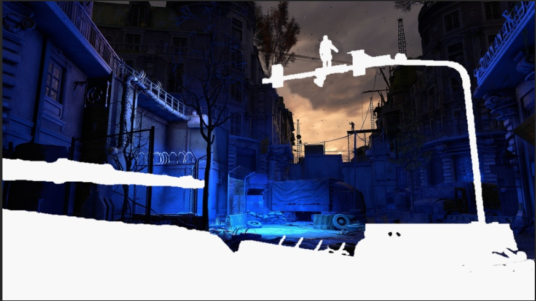
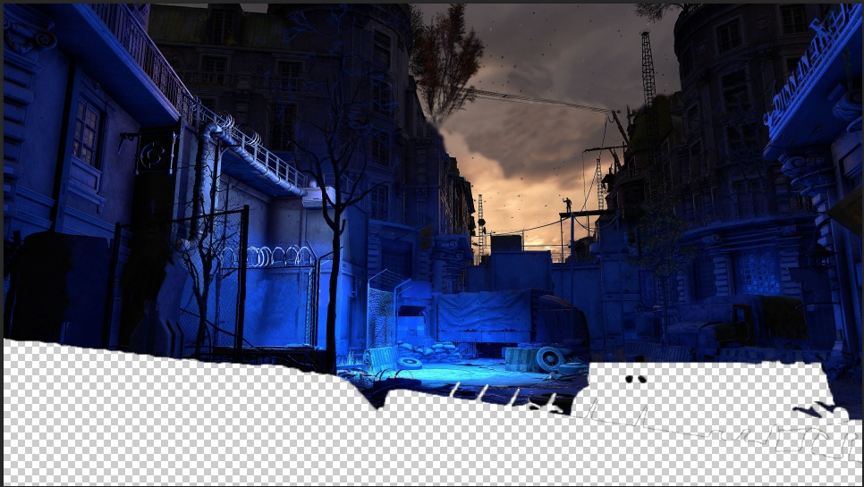
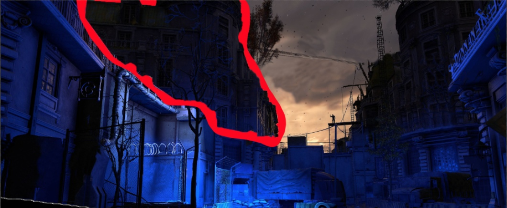
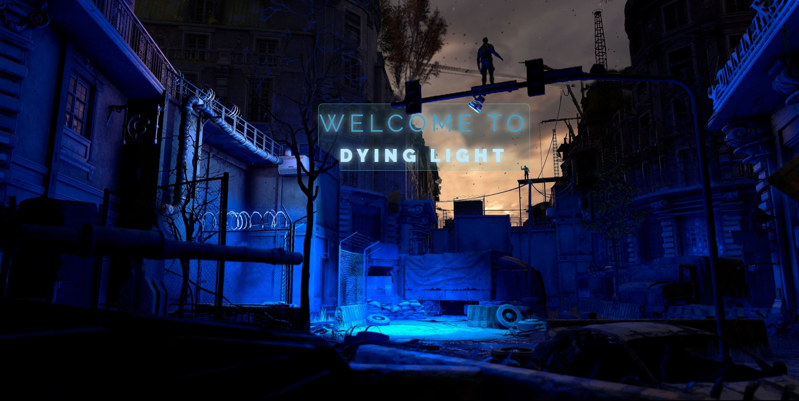
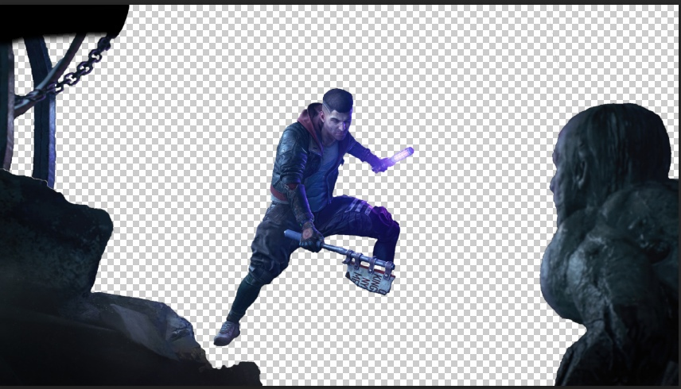
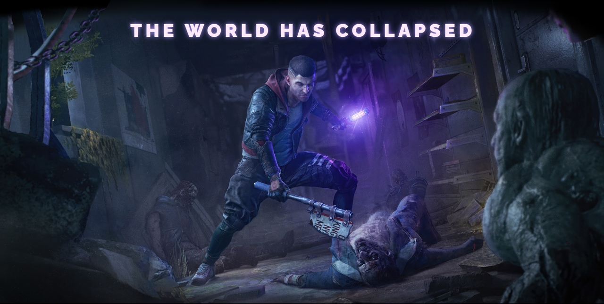
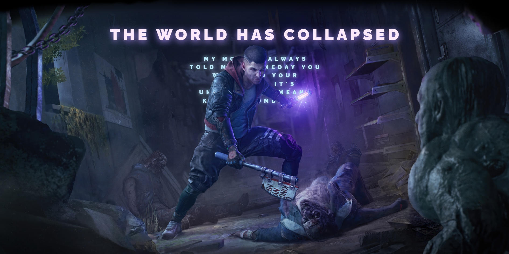

# [Game Parallax](https://game-parralax-7sruu94qw-twincki.vercel.app/)

Данный проект был создан после просмотра видеоурока от канала [WebDesign Master](https://www.youtube.com/@wdm).

Задачи по проекту:

- Повторение проекта по видеоуроку.
- Проект выполнять со своими исходниками.
- Постараться сделать максимально похожий результат по итогу видеоурока.
- Добавить свои задумки.

---

### 1.0 Стартовая версия проекта

- Создан Html.
- Вырезаны слои в photoshop.

- Добавлены и настроены первоначальные стили.

---

### 1.1 Исправление исходников

При прокрутке страницы вниз находящиеся вырезанные части за слоями, были видны черным цветом.

Пример:

Для исправления я дорисовывал в photoshop недостающие части.

Пример того что было до:

Пример того как стало после:

В видеоуроке исходники подобраны таким образом что слои перекрывают все за собой и такие манипуляции в photoshop не нужны были, свои же исходники я выбирал что бы были схожи по смыслу нижний и верхний уровень.

---

### 1.2 Добавление новых стилей и исправление старых.

- Добавлен новый слой для увеличения эффекта parallax.
- Новые стили для стартовой страницы.
- Исправление изображений.
- Исправление parallax эффекта.

Новый слой:

Новый стиль стартовой страницы:

---

### 1.3 Исправления стиля нижней части страницы

- Добавлен плавный скролл.
- Вырезаны отдельные части низа страницы для будущего эффекта parallax.
- Добавлены эффекты на нижней части для эффекта слияния с верхней.

Новые слои duungeon:

Пример версии dungeon:

---

### 1.4 Изменние нижней части страницы

- Доабалена parallax эффект переднего плана низа сайта.
- Отредактирована задняя часть низа сайта для правильности отображения parallax эффекта
- Добавлен текст за персонажем.
- Добавлен parallax эффект текста за персонажем.

Вид нижней части сайта:

